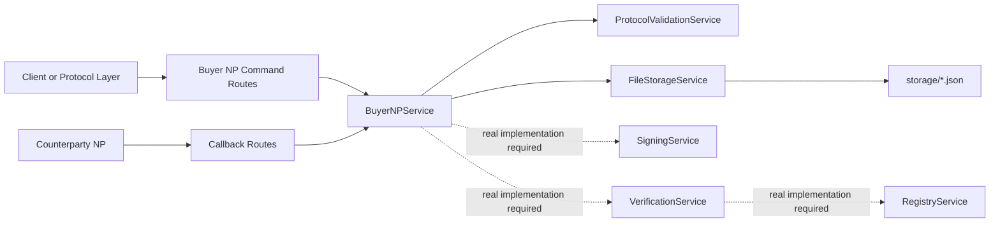

# Architecture - ONDC Buyer NP

## Purpose

This repository implements a FastAPI-based ONDC Buyer NP / BAP for Mutual Funds on `ONDC:FIS14`.

The service accepts Buyer NP command requests, receives asynchronous `on_*` callbacks, validates the FIS14 context envelope, returns ACK responses, and persists every event as JSON in the filesystem.

## Runtime Components

```text
app/
├── main.py                         # FastAPI app, health endpoint, OpenAPI metadata
├── api/router.py                   # Router composition
├── routes/ondc.py                  # Buyer NP command routes
├── callbacks/ondc_callbacks.py     # Callback receiver routes
├── schemas/                        # FIS14 context and ACK schemas
├── services/                       # Buyer NP orchestration and support services
├── repositories/                   # Repository protocol and default filesystem adapter
└── core/                           # Settings and logging
```

## Flow



## Buyer NP Commands

- `/ondc/search`
- `/ondc/select`
- `/ondc/init`
- `/ondc/confirm`
- `/ondc/status`
- `/ondc/cancel`
- `/ondc/update`
- `/ondc/support`
- `/ondc/track`

## Callback Receivers

- `/ondc/on_search`
- `/ondc/on_select`
- `/ondc/on_init`
- `/ondc/on_confirm`
- `/ondc/on_status`
- `/ondc/on_cancel`
- `/ondc/on_update`
- `/ondc/on_support`
- `/ondc/on_track`

## Persistence

The default repository is `FileStorageService`. It writes each event as JSON.

```text
storage/
├── search/
├── select/
├── init/
├── confirm/
└── callbacks/
```

Commands outside the four primary folders are written to `storage/{action}/`. Callbacks are written to `storage/callbacks/{action}/`.

## Signing Policy

No fake signing is implemented.

`SigningService` can detect whether subscriber ID, unique key ID, signing private key path, and signing public key path are configured. If any value or file is unavailable, it returns TODO placeholders through `get_key_status()`.

Production Ed25519 Authorization header generation and inbound signature verification must be implemented before ONDC PreProd or Production use.

## Configuration

Required `.env` values:

- `SUBSCRIBER_ID`
- `UNIQUE_KEY_ID`
- `BAP_ID`
- `BAP_URI`
- `BAP_CALLBACK_URI`
- `ONDC_DOMAIN`
- `ONDC_VERSION`

Optional but expected before ONDC network testing:

- `ONDC_REGISTRY_URL`
- `SIGNING_PRIVATE_KEY`
- `SIGNING_PUBLIC_KEY`
- `ENCRYPTION_PRIVATE_KEY`
- `ENCRYPTION_PUBLIC_KEY`
- `REQUIRE_ONDC_AUTH`

