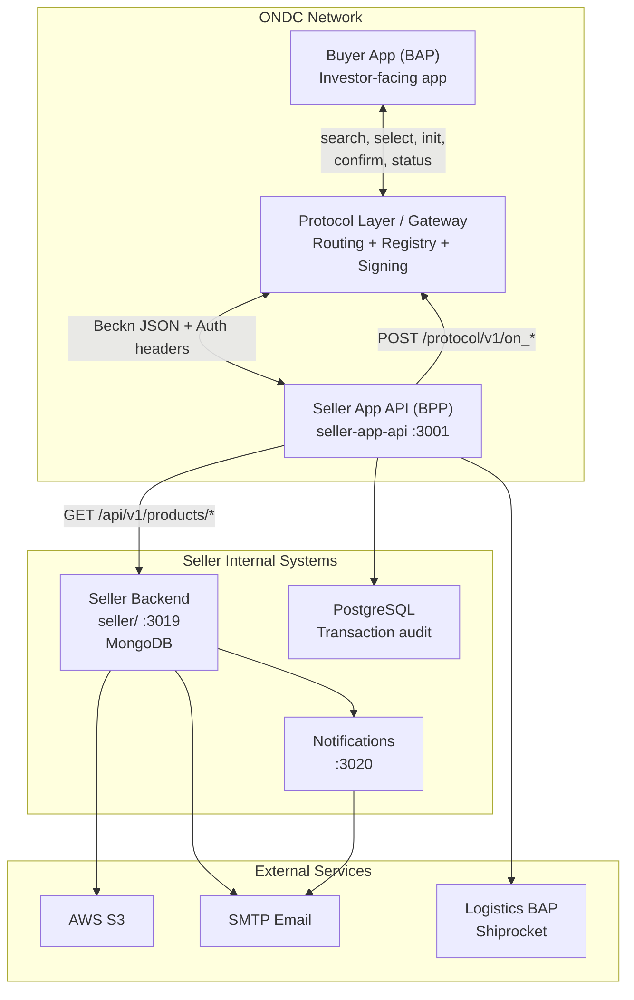
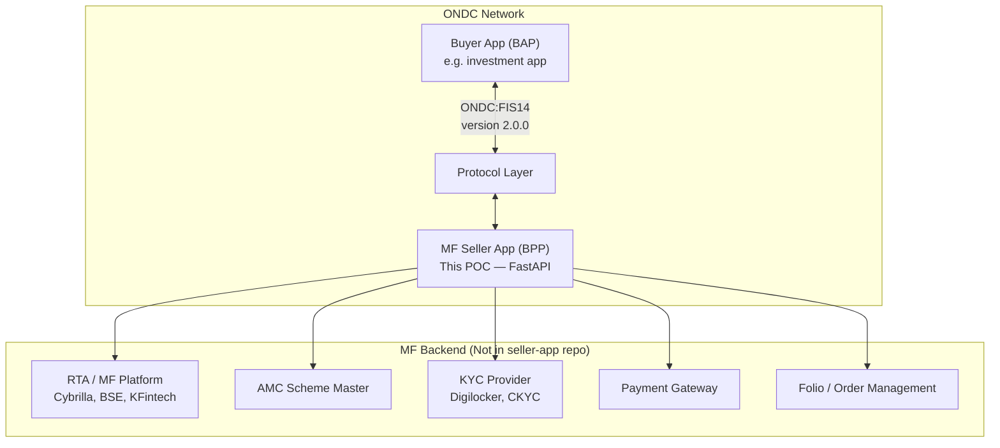
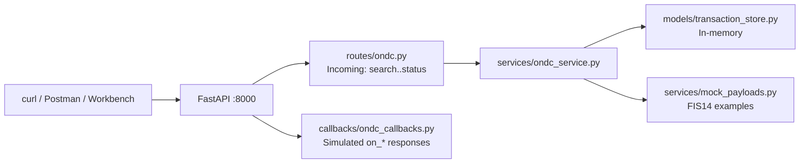

# Architecture — ONDC Seller App Analysis

## 1. Executive Summary

The ONDC ecosystem separates **Buyer Apps (BAP)** and **Seller Apps (BPP)** connected via a **Protocol Layer** using the open **Beckn protocol**. Messages are JSON over HTTPS with asynchronous callbacks (`on_*` actions).

For **Mutual Funds**, the relevant domain is **`ONDC:FIS14`** (Financial Services — Investments). The retail reference repo `ONDC-Official/seller-app` provides architectural patterns but **cannot be used as-is** for MF.

---

## 2. Official seller-app Repository Structure

```
seller-app/
├── docker-compose.yaml       # Orchestration (incomplete)
├── sellerApiDocker           # Dockerfile → seller-app-api
├── sellerDocker              # Dockerfile → seller/ (catalog backend)
├── notificationDocker        # Dockerfile → notifications/
├── seller/                   # Seller Client Backend (MongoDB)
├── seller-app-api/           # ONDC BPP Protocol Adapter (PostgreSQL)
└── notifications/            # Email/notification microservice
```

### 2.1 `seller/` — Seller Client Backend

| Item | Detail |
|------|--------|
| **Purpose** | Internal seller operations: IAM, product catalog, orders, settlements |
| **Runtime** | Node.js 16+, Express, Babel |
| **Database** | MongoDB (Mongoose) |
| **Default port** | 3008 (config) / 3019 (Docker) |
| **Key modules** | `authentication/`, `product/`, `order/`, `customization/`, `email/` |

**Folder breakdown:**

| Path | Purpose |
|------|---------|
| `app/server.js` | Express bootstrap, middleware, session map |
| `app/init/database.init.js` | MongoDB connection |
| `app/init/router.init.js` | Auto-loads `**/*.route.js` modules |
| `app/config/environments/` | Environment-specific config (base, db, cors, email, aws) |
| `app/config/local.env` | **Not committed** — must be created manually |
| `app/lib/authentication/` | Passport JWT, login flows |
| `app/lib/utils/s3Utils.js` | AWS S3 image upload |
| `app/modules/product/` | Product CRUD, variants, custom menus |
| `app/modules/order/` | Orders, fulfillments, settlements, returns |

### 2.2 `seller-app-api/` — ONDC BPP Adapter

| Item | Detail |
|------|--------|
| **Purpose** | Receives ONDC protocol calls from BAP; maps to internal seller APIs; sends `on_*` callbacks |
| **Runtime** | Node.js 16+, Express, Babel, Sequelize |
| **Database** | PostgreSQL (transaction state: SearchRequest, SelectRequest, InitRequest, ConfirmRequest) |
| **Default port** | 3001 |
| **Routes** | `/api/v1/client/*`, `/api/v2/client/*` |

**Folder breakdown:**

| Path | Purpose |
|------|---------|
| `bin/www` | HTTP server entry; Sequelize `sync()` before listen |
| `app.js` | Express app, CORS, route mounting |
| `routes/v2/ondc.routes.js` | ONDC endpoints: search, select, init, confirm, cancel, status, track |
| `controllers/v2/ondc.controller.js` | Request validation, delegates to service |
| `services/v2/ondc.service.js` | Core ONDC flow logic (~2800 lines) |
| `services/v2/product.service.js` | Catalog mapping, category-specific schema builders |
| `utils/v2/category/` | Per-domain mappers (grocery, fnb, fashion, etc.) |
| `utils/protocolApis/` | HTTP client to ONDC Protocol Layer |
| `lib/config/*.json` | nconf layered configuration |
| `models/` | Sequelize models for protocol request tracking |

### 2.3 `notifications/` — Notification Service (NES)

| Item | Detail |
|------|--------|
| **Purpose** | Transactional email notifications |
| **Runtime** | Node.js, Express |
| **Database** | Mongoose declared but `database.init.js` is empty |
| **Default port** | 3008 (conflicts with seller unless changed) / 3020 in Docker |

---

## 3. Tech Stack Summary

| Layer | Technology |
|-------|------------|
| Language | JavaScript (ES6+, Babel transpilation) |
| Web framework | Express 4.x |
| Seller DB | MongoDB + Mongoose 6 |
| ONDC API DB | PostgreSQL + Sequelize 5 |
| Auth | Passport JWT, bcryptjs |
| Validation | Joi / @hapi/joi |
| Email | Nodemailer, email-templates, Pug |
| File storage | AWS S3 (aws-sdk v2) |
| Push | Firebase Admin (commented out in app.js) |
| Reporting | jsreport + Chromium (PDF/Excel) |
| Containerization | Docker (Node 16 Alpine) |

---

## 4. Dependency Explanation (seller-app-api)

| Package | Purpose |
|---------|---------|
| `express` | HTTP server |
| `sequelize`, `pg` | PostgreSQL ORM for protocol transaction logs |
| `nconf` | Layered JSON config (base + env) |
| `axios`, `node-fetch` | HTTP calls to protocol layer and seller backend |
| `uuid` | Generate message_id, transaction_id |
| `passport-jwt` | JWT auth for internal APIs |
| `@hapi/joi` | Request validation |
| `winston` | Structured logging |
| `firebase-admin` | Push notifications (optional) |
| `nodemailer` | Exception/transaction emails |
| `bull` | **Declared but unused** — would need Redis |
| `mysql`, `mysql2` | **Declared but unused** — dialect is postgres |

---

## 5. Infrastructure Components

### 5.1 Databases

| Service | DB | Data Stored |
|---------|-----|-------------|
| `seller/` | MongoDB | Users, orgs, products, orders, settlements |
| `seller-app-api/` | PostgreSQL | ONDC request/response JSONB audit trail |
| `notifications/` | None operational | Stateless email dispatch |

### 5.2 Message Queues / Cache

| Component | Status |
|-----------|--------|
| Redis | Not configured; commented TODO in code |
| Kafka | Not used |
| RabbitMQ | Not used |
| Bull (Redis queue) | Dependency only, no instantiation |
| node-cache | In-memory cache in seller server |

### 5.3 External Services

| Service | Consumer | Purpose |
|---------|----------|---------|
| ONDC Protocol Layer | seller-app-api | Network routing, registry lookup, signing |
| Seller Client API | seller-app-api | Product catalog, org details |
| AWS S3 | seller/ | Product images |
| SMTP | All services | Email |
| MapMyIndia | seller/ | Maps/geocoding |
| Shiprocket | seller-app-api | Logistics BAP integration (retail) |
| Strapi CMS | docker-compose | **Dockerfile missing** — deprecated integration |

---

## 6. Docker Setup Analysis

`docker-compose.yaml` defines 3 services:

```yaml
strapi    → port 1337  (Dockerfile strapiDocker — MISSING from repo)
seller    → port 3001  (Actually builds seller-app-api via sellerApiDocker)
postgres  → port 5432  (DB for seller-app-api)
```

**Gaps in docker-compose:**

1. `strapiDocker` file does not exist — Strapi service cannot build
2. Service named `seller` builds `seller-app-api`, not the MongoDB `seller/` backend
3. MongoDB-backed `seller/` service is not included
4. `notifications/` service is not included
5. No MongoDB container defined

---

## 7. Environment Variables

No `.env` templates are committed. Configuration is inferred from source:

### seller-app-api (nconf JSON + env overrides)

| Variable | Purpose |
|----------|---------|
| `NODE_ENV` | `development` or `production` config file selection |
| `PORT` | HTTP port (default 3001) |
| `PROTOCOL_BASE_URL` | ONDC protocol layer base URL |
| `DATABASE_HOST/PORT/USERNAME/PASSWORD/NAME_SELLER_CLIENT` | PostgreSQL |
| `SELLER_SERVER_URL` | Internal seller backend URL (default `http://localhost:3019`) |
| `BPP_ID`, `BPP_URI` | Your subscriber identity on ONDC network |
| `BAP_ID`, `BAP_URI` | Buyer app identity (for logistics cascaded flows) |
| `FIREBASE_SERVICE_ACCOUNT_JSON_PATH` | Firebase push config |
| `STRAPI_SERVER_URL`, `STRAPI_API_TOKEN` | Strapi CMS (legacy) |

### seller/ (local.env when APP_ENV=local)

| Variable | Purpose |
|----------|---------|
| `MONGODB_DATABASE_HOST/NAME/USERNAME/PASSWORD` | MongoDB connection |
| `BASE_APP_PORT` | Server port |
| `AUTH_ACCESS_JWT_SECRET` | JWT signing |
| `S3_*` | AWS S3 credentials |
| `SMTP_*` | Email transport |

---

## 8. Architecture Diagram

### 8.1 Retail seller-app (Reference)



### 8.2 Mutual Fund Seller App (Target — ONDC:FIS14)



### 8.3 FastAPI POC (This Project)



---

## 9. ONDC Components Explained (Beginner-Friendly)

| Term | Meaning |
|------|---------|
| **ONDC** | Open Network for Digital Commerce — open protocol network (like UPI for commerce/finance) |
| **BAP** | Buyer App Platform — the app the customer uses |
| **BPP** | Buyer Provider Platform / Seller App — the app listing/selling services |
| **Beckn Protocol** | Open standard ONDC is built on; defines message formats and async callback pattern |
| **context** | Metadata envelope: domain, action, transaction_id, message_id, bap_id, bpp_id, timestamps |
| **message** | Business payload: intent, order, catalog, etc. |
| **ACK/NACK** | Immediate synchronous response acknowledging receipt |
| **on_* callback** | Asynchronous response sent to the other party's URI after processing |
| **Registry** | ONDC directory of network participants with public keys for signature verification |
| **Subscriber ID** | Unique network identity (e.g., `yourcompany.in/ondc`) |
| **Protocol Layer** | Middleware that routes messages between BAP and BPP with signing/verification |
| **Domain** | Category of commerce: RET10=Grocery, FIS14=Mutual Funds, FIS12=Loans, etc. |

---

## 10. Mutual Funds vs Retail seller-app

| Concern | Retail seller-app | MF (FIS14) |
|---------|-------------------|------------|
| Domain code | `ONDC:RET10` etc. | `ONDC:FIS14` |
| Catalog | Products with MRP, variants | Schemes with NAV, exit load, SIP min |
| Fulfillment type | Delivery, Self-Pickup | LUMPSUM, SIP, REDEMPTION |
| Logistics integration | Shiprocket LSP cascaded flow | Not applicable |
| KYC | Not in retail flow | Multi-step forms (Digilocker, eSign) |
| Payment | POST-FULFILLMENT / ON-ORDER | PRE-FULFILLMENT with PG redirect |
| Post-confirm updates | Order tracking | `on_update` for allotment, SIP instalment |
| Spec branch | seller-app repo | `draft-FIS14-enhancements` |
