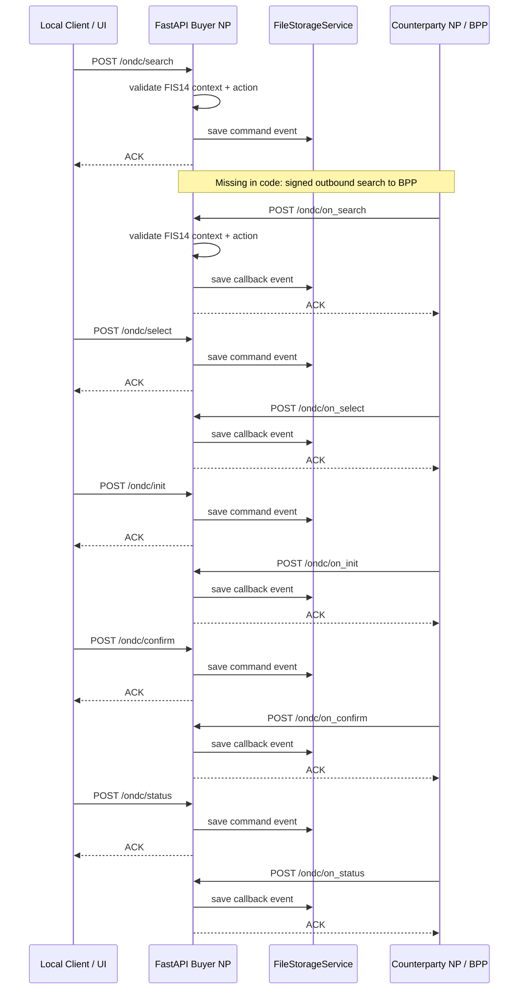

# Buyer NP Audit Report

Audit date: 2026-06-03  
Project root audited: `d:\project\ONDC-BACKEND\ONDC-POC`

## Executive Summary

Classification: **ONDC Buyer NP (BAP) implementation for Mutual Funds / Investment domain**.

The FastAPI application exposes all requested Buyer NP command endpoints and all matching `on_*` callback receiver endpoints under the `/ondc` prefix. The implementation validates a strict FIS14 envelope, enforces endpoint/action matching, persists events in a filesystem repository, and returns ONDC-style ACK responses.

It is **not production ready** and is **not ready for ONDC PreProd/UAT traffic** without additional work. Critical gaps are production Ed25519 signing, inbound signature verification, registry verification, durable transaction persistence, outbound BPP dispatch, timestamp/TTL freshness enforcement, real environment-specific registry support, and deployment hardening.

Readiness score: **42 / 100**

## Phase 1: Project Classification

| Category | Finding |
|---|---|
| Classification | ONDC Buyer NP (BAP) |
| Domain | Mutual Funds / Investment domain |
| ONDC domain code | `ONDC:FIS14` |
| Protocol version in code | `2.0.0` |
| Production compliance | Not production compliant |
| Hybrid Buyer + Provider | No application-level counterparty provider implementation found |
| Notable documentation conflict | `README.md` still contains older Buyer NP wording, while app code and newer docs are Buyer NP oriented |

### Evidence

Routes:

- `app/routes/ondc.py` defines Buyer NP command endpoints: `/ondc/search`, `/ondc/select`, `/ondc/init`, `/ondc/confirm`, `/ondc/status`, `/ondc/update`, `/ondc/cancel`, `/ondc/track`, `/ondc/support`.
- `app/callbacks/ondc_callbacks.py` defines BPP callback receivers for Buyer NP: `/ondc/on_search`, `/ondc/on_select`, `/ondc/on_init`, `/ondc/on_confirm`, `/ondc/on_status`, `/ondc/on_update`, `/ondc/on_cancel`, `/ondc/on_track`, `/ondc/on_support`.
- `app/api/router.py` includes both command and callback routers.

Schemas:

- `app/schemas/fis14.py` defines `FIS14CommandRequest` and `FIS14CallbackRequest`.
- `app/schemas/ondc.py` hard-codes `ONDC_FIS14_DOMAIN = "ONDC:FIS14"` and `ONDC_FIS14_VERSION = "2.0.0"`.
- `app/schemas/ondc.py` separates command and callback actions through `COMMAND_ACTIONS` and `CALLBACK_ACTIONS`.

Services:

- `app/services/buyer_np_service.py` orchestrates Buyer NP commands and callbacks, validates protocol action, saves events, and returns ACK.
- `app/services/protocol_validation.py` enforces endpoint/action matching.
- `app/services/signing_service.py`, `verification_service.py`, and `registry_service.py` are production boundary placeholders, not complete implementations.

Callbacks:

- `app/callbacks/ondc_callbacks.py` receives BPP `on_*` callbacks and stores them in the same transaction repository used for commands.

Config:

- `.env.example` and `app/core/config.py` expose `SUBSCRIBER_ID`, `UNIQUE_KEY_ID`, `SIGNING_PRIVATE_KEY`, `ONDC_REGISTRY_URL`, `BAP_ID`, `BAP_URI`, and `BAP_CALLBACK_URI`.
- `APP_NAME` defaults to `ONDC MF Buyer NP`.

Protocol specifications:

- `fis-specs/api/components/attributes/mutual-funds/context.yaml` marks `domain`, `location`, `timestamp`, `bap_id`, `transaction_id`, `message_id`, `version`, `action`, `bap_uri`, and `ttl` as mandatory for FIS14.
- `fis-specs/api/components/flows/mutual-funds/lumpsum.yaml` shows the expected command/callback flow: `select -> on_select -> init -> on_init -> confirm -> on_confirm -> on_status -> on_update`.
- `fis-specs/api/components/docs/log-verification.md` lists log verification artifacts for `search`, `on_search`, `select`, `on_select`, `init`, `on_init`, `confirm`, `on_confirm`, `status`, `on_status`, `update`, and `on_update`.

## Phase 2: ONDC Buyer NP API Compliance

Note: the requested logical APIs are exposed under the application prefix `/ondc`. No root-level `/search` or `/on_search` routes were found.

| API | Actual route | Controller | Service | Request schema | Response schema | Implementation | Production ready |
|---|---|---|---|---|---|---|---|
| POST /search | `/ondc/search` | `app/routes/ondc.py::search` | `buyer_np_service.handle_command(..., "search")` | `FIS14CommandRequest` | `ONDCAckResponse` | Implemented as local ACK + persist; no BPP dispatch | No |
| POST /select | `/ondc/select` | `app/routes/ondc.py::select` | `buyer_np_service.handle_command(..., "select")` | `FIS14CommandRequest` | `ONDCAckResponse` | Implemented as local ACK + persist; no BPP dispatch | No |
| POST /init | `/ondc/init` | `app/routes/ondc.py::init_order` | `buyer_np_service.handle_command(..., "init")` | `FIS14CommandRequest` | `ONDCAckResponse` | Implemented as local ACK + persist; no BPP dispatch | No |
| POST /confirm | `/ondc/confirm` | `app/routes/ondc.py::confirm` | `buyer_np_service.handle_command(..., "confirm")` | `FIS14CommandRequest` | `ONDCAckResponse` | Implemented as local ACK + persist; no BPP dispatch | No |
| POST /status | `/ondc/status` | `app/routes/ondc.py::status` | `buyer_np_service.handle_command(..., "status")` | `FIS14CommandRequest` | `ONDCAckResponse` | Implemented as local ACK + persist; no BPP dispatch | No |
| POST /cancel | `/ondc/cancel` | `app/routes/ondc.py::cancel` | `buyer_np_service.handle_command(..., "cancel")` | `FIS14CommandRequest` | `ONDCAckResponse` | Implemented as local ACK + persist; no BPP dispatch | No |
| POST /update | `/ondc/update` | `app/routes/ondc.py::update` | `buyer_np_service.handle_command(..., "update")` | `FIS14CommandRequest` | `ONDCAckResponse` | Implemented as local ACK + persist; no BPP dispatch | No |
| POST /support | `/ondc/support` | `app/routes/ondc.py::support` | `buyer_np_service.handle_command(..., "support")` | `FIS14CommandRequest` | `ONDCAckResponse` | Implemented as local ACK + persist; no BPP dispatch | No |
| POST /track | `/ondc/track` | `app/routes/ondc.py::track` | `buyer_np_service.handle_command(..., "track")` | `FIS14CommandRequest` | `ONDCAckResponse` | Implemented as local ACK + persist; no BPP dispatch | No |
| POST /on_search | `/ondc/on_search` | `app/callbacks/ondc_callbacks.py::on_search` | `buyer_np_service.handle_callback(..., "on_search")` | `FIS14CallbackRequest` | `ONDCAckResponse` | Implemented as local ACK + persist; no signature verification | No |
| POST /on_select | `/ondc/on_select` | `app/callbacks/ondc_callbacks.py::on_select` | `buyer_np_service.handle_callback(..., "on_select")` | `FIS14CallbackRequest` | `ONDCAckResponse` | Implemented as local ACK + persist; no signature verification | No |
| POST /on_init | `/ondc/on_init` | `app/callbacks/ondc_callbacks.py::on_init` | `buyer_np_service.handle_callback(..., "on_init")` | `FIS14CallbackRequest` | `ONDCAckResponse` | Implemented as local ACK + persist; no signature verification | No |
| POST /on_confirm | `/ondc/on_confirm` | `app/callbacks/ondc_callbacks.py::on_confirm` | `buyer_np_service.handle_callback(..., "on_confirm")` | `FIS14CallbackRequest` | `ONDCAckResponse` | Implemented as local ACK + persist; no signature verification | No |
| POST /on_status | `/ondc/on_status` | `app/callbacks/ondc_callbacks.py::on_status` | `buyer_np_service.handle_callback(..., "on_status")` | `FIS14CallbackRequest` | `ONDCAckResponse` | Implemented as local ACK + persist; no signature verification | No |
| POST /on_cancel | `/ondc/on_cancel` | `app/callbacks/ondc_callbacks.py::on_cancel` | `buyer_np_service.handle_callback(..., "on_cancel")` | `FIS14CallbackRequest` | `ONDCAckResponse` | Implemented as local ACK + persist; no signature verification | No |
| POST /on_update | `/ondc/on_update` | `app/callbacks/ondc_callbacks.py::on_update` | `buyer_np_service.handle_callback(..., "on_update")` | `FIS14CallbackRequest` | `ONDCAckResponse` | Implemented as local ACK + persist; no signature verification | No |
| POST /on_support | `/ondc/on_support` | `app/callbacks/ondc_callbacks.py::on_support` | `buyer_np_service.handle_callback(..., "on_support")` | `FIS14CallbackRequest` | `ONDCAckResponse` | Implemented as local ACK + persist; no signature verification | No |
| POST /on_track | `/ondc/on_track` | `app/callbacks/ondc_callbacks.py::on_track` | `buyer_np_service.handle_callback(..., "on_track")` | `FIS14CallbackRequest` | `ONDCAckResponse` | Implemented as local ACK + persist; no signature verification | No |

## Phase 6: Callback Flow Validation

Current implemented behavior:

1. Commands are accepted at `/ondc/{action}`.
2. `ProtocolValidationService` checks that `context.action` matches the endpoint.
3. `BuyerNPService` stores the event in `FileStorageService`.
4. The service returns `{"message":{"ack":{"status":"ACK"}}}`.
5. Callback endpoints accept `/ondc/on_{action}` and store callback events under the same `transaction_id`.

Missing production flow behavior:

- No actual outbound HTTPS call from Buyer NP to target BPP.
- No use of `BPP_URI` for dispatch.
- No signing of outbound requests.
- No verification of inbound callback signatures.
- No state machine preventing out-of-order callback events.
- No durable persistence across process restart.

### Sequence Diagram

### Transaction Persistence

| Feature | Status | Evidence |
|---|---|---|
| Save command events | Implemented | `BuyerNPService._save_event`; `FileStorageService.save_event` |
| Save callback events | Implemented | `BuyerNPService.handle_callback` |
| Correlate by `transaction_id` | Implemented locally | `get_by_transaction_id` |
| Prevent duplicate `message_id` | Implemented locally | `_events_by_message` and `DuplicateMessageError` |
| Durable DB | Partial | Filesystem JSON persistence exists; database persistence is still missing |
| Cross-worker/process consistency | Missing | No Redis/PostgreSQL/shared store |
| Audit retention | Missing | No durable audit schema or retention policy |

## Phase 11: ONDC UAT Readiness

| Target | Ready? | Reason |
|---|---|---|
| ONDC PreProd Testing | No | No signing, verification, registry verification, public deployment artifacts, durable store, or BPP dispatch |
| Pramaan Testing | No | No auth header generation/validation and no production-grade FIS14 state validation |
| Registry Verification | No | Registry lookup boundary exists, but verification flow and registered keys are missing |

### UAT Blockers

1. Implement Ed25519/BLAKE signing for every outbound ONDC request.
2. Verify every inbound callback Authorization header using registry public keys.
3. Add registry environment mapping for PreProd and Production.
4. Obtain and configure real `SUBSCRIBER_ID`, `UNIQUE_KEY_ID`, signing keys, public registry entries, `BAP_ID`, `BAP_URI`, and callback URI.
5. Implement outbound BPP dispatch with retry, timeout, NACK/error handling, and observability.
6. Replace filesystem repository with PostgreSQL or equivalent production durable storage.
7. Enforce timestamp freshness and TTL expiry, not just string format.
8. Add FIS14 message-level validation beyond the envelope.
9. Add system tests for the complete `search -> on_search -> select -> on_select -> init -> on_init -> confirm -> on_confirm -> status -> on_status` flow.
10. Decide whether target protocol is still `2.0.0` or should move to the newer local `FIS14_2.1.0` change set present in `fis-specs`.

