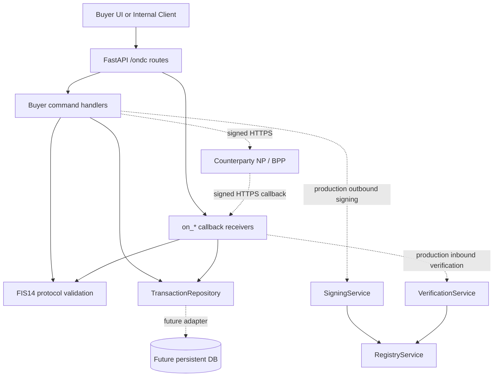

# ONDC Buyer NP Architecture

## Purpose

This FastAPI application is structured as an ONDC Buyer NP/BAP implementation for Mutual Funds using `ONDC:FIS14`.

Buyer command endpoints accept validated BAP protocol requests, persist protocol events, and return ACK. Callback endpoints receive BPP `on_*` responses, validate the same FIS14 envelope rules, persist the callback event, and return ACK.

## API Surface

### Buyer NP Commands

- `POST /ondc/search`
- `POST /ondc/select`
- `POST /ondc/init`
- `POST /ondc/confirm`
- `POST /ondc/status`
- `POST /ondc/update`
- `POST /ondc/cancel`
- `POST /ondc/track`
- `POST /ondc/support`

### Buyer NP Callback Receivers

- `POST /ondc/on_search`
- `POST /ondc/on_select`
- `POST /ondc/on_init`
- `POST /ondc/on_confirm`
- `POST /ondc/on_status`
- `POST /ondc/on_update`
- `POST /ondc/on_cancel`
- `POST /ondc/on_track`
- `POST /ondc/on_support`

## Runtime Flow



## Code Map

```text
app.main
  -> app.api.router
    -> app.routes.ondc
      -> BuyerNPService.handle_command
        -> ProtocolValidationService.validate_command
        -> TransactionRepository.save_event
    -> app.callbacks.ondc_callbacks
      -> BuyerNPService.handle_callback
        -> ProtocolValidationService.validate_callback
        -> TransactionRepository.save_event

app.services.registry_service
  -> ONDC registry lookup boundary

app.services.signing_service
  -> outbound Authorization header boundary

app.services.verification_service
  -> inbound Authorization header verification boundary
```

## Validation Rules

The strict FIS14 context schema enforces:

- `domain == "ONDC:FIS14"`
- `version == "2.0.0"`
- required non-empty `transaction_id`
- required non-empty `message_id`
- required non-empty `bap_id`
- required non-empty `bap_uri`
- required RFC3339/ISO-8601 compatible `timestamp`
- `ttl` in `PTnH`, `PTnM`, or `PTnS` form
- known ONDC action

The protocol validation service enforces endpoint/action matching, such as `POST /ondc/search` requiring `context.action == "search"` and `POST /ondc/on_search` requiring `context.action == "on_search"`.

## Repository Boundary

The app depends on `TransactionRepository`, currently backed by `FileStorageService` for local development and UAT evidence capture. The repository prevents duplicate `message_id` values and can be replaced by a database-backed implementation for production.

## Signing and Registry

No fake crypto is implemented.

Production integration points:

- `RegistryService.lookup_subscriber`
- `SigningService.build_authorization_header`
- `VerificationService.verify_headers`

Required configuration:

- `SUBSCRIBER_ID`
- `UNIQUE_KEY_ID`
- `SIGNING_PRIVATE_KEY`
- `ONDC_REGISTRY_URL`
- `REQUIRE_ONDC_AUTH=true` for inbound verification enforcement

