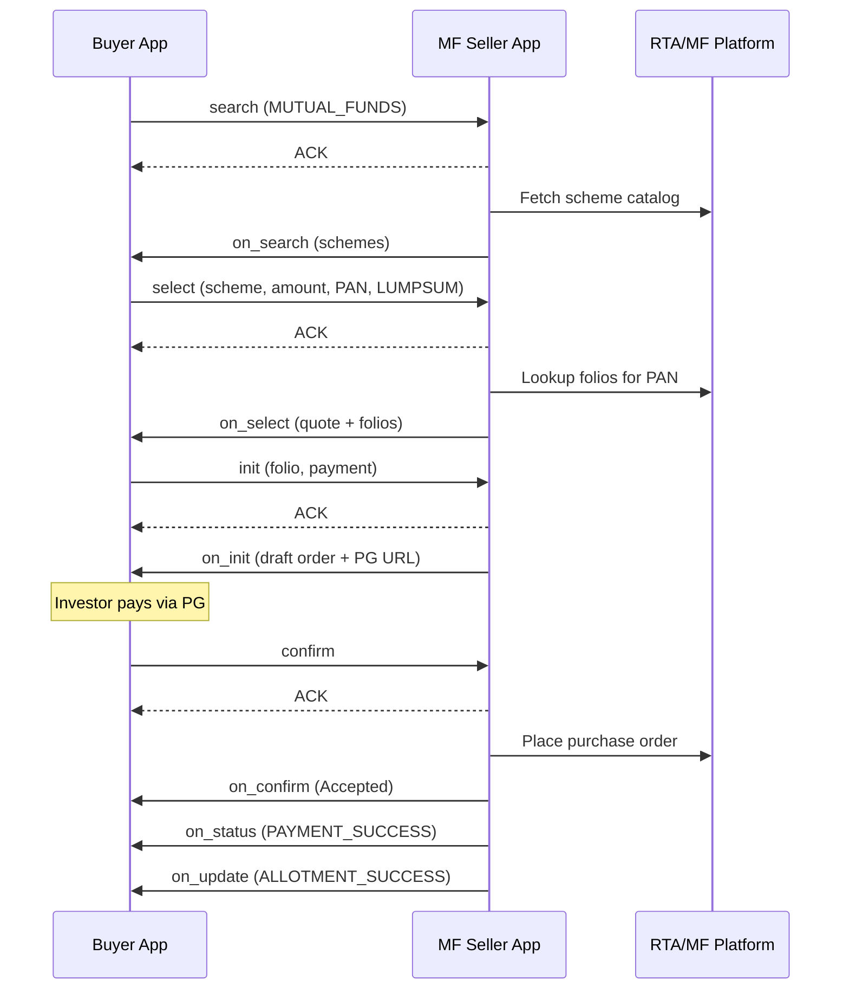
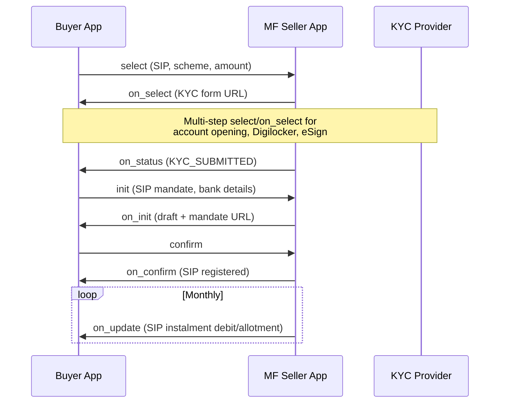
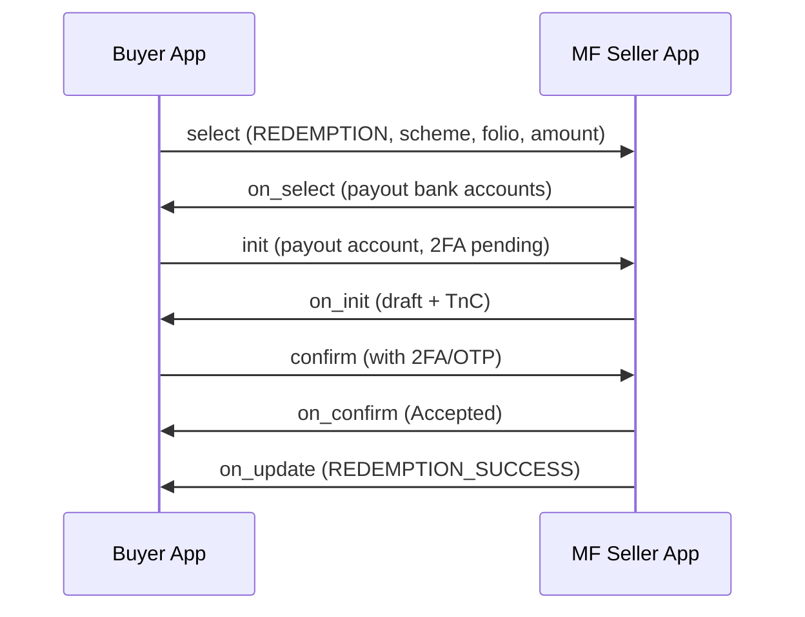

# ONDC Flow — Mutual Funds (ONDC:FIS14)

This document explains the Beckn/ONDC transaction lifecycle for **Mutual Funds** based on the official `ONDC-FIS-Specifications` branch `draft-FIS14-enhancements`.

> **Note:** The retail `seller-app` repo implements a similar async ACK + callback pattern but for physical goods with logistics. MF flows use `ONDC:FIS14`, version `2.0.0`, and city code `"*"`.

---

## Async Pattern (All APIs)

Every ONDC API follows the same pattern:

```
BAP                          BPP (Seller App)
 |                                |
 |--- POST /{action} ----------->|  (search, select, init, confirm, status)
 |<-- {"message":{"ack":"ACK"}}--|  (immediate synchronous ACK)
 |                                |  (BPP processes request)
 |<-- POST /on_{action} ----------|  (async callback to BAP's bap_uri)
 |-- {"message":{"ack":"ACK"}} -->|
```

- **transaction_id** stays constant across the entire journey
- **message_id** is unique per message
- **action** in context identifies the API (`search`, `on_search`, etc.)

---

## 1. SEARCH / ON_SEARCH

### Purpose

Buyer app discovers available mutual fund schemes. Seller app responds with a **catalog** of schemes grouped by category (Equity, Debt, Hybrid, etc.).

### Request — `POST /search`

**Source:** `fis-specs/api/components/examples/mutual-funds/search/search.json`

```json
{
  "context": {
    "domain": "ONDC:FIS14",
    "action": "search",
    "version": "2.0.0",
    "location": { "country": {"code": "IND"}, "city": {"code": "*"} },
    "bap_id": "api.buyerapp.com",
    "bap_uri": "https://api.buyerapp.com/ondc",
    "transaction_id": "...",
    "message_id": "...",
    "timestamp": "...",
    "ttl": "PT10M"
  },
  "message": {
    "intent": {
      "category": { "descriptor": { "code": "MUTUAL_FUNDS" } },
      "fulfillment": {
        "agent": {
          "organization": {
            "creds": [{ "id": "ARN-125784", "type": "ARN" }]
          }
        }
      }
    }
  }
}
```

**Key fields:**

| Field | Meaning |
|-------|---------|
| `intent.category.descriptor.code` | `MUTUAL_FUNDS` — filter for investment products |
| `fulfillment.agent.organization.creds` | Distributor ARN (regulatory credential) |
| `location.city.code` | Must be `"*"` for MF (pan-India) |

### Response — Immediate ACK

```json
{ "message": { "ack": { "status": "ACK" } } }
```

### Callback — `POST {bap_uri}/on_search`

**Source:** `fis-specs/.../on_search/on_search.json`

```json
{
  "context": { "action": "on_search", "bpp_id": "...", "bpp_uri": "..." },
  "message": {
    "catalog": {
      "descriptor": { "name": "BPP Name" },
      "providers": [{
        "id": "sellerapp_id",
        "categories": [ /* MUTUAL_FUNDS > OPEN_ENDED > EQUITY > MIDCAP */ ],
        "items": [{
          "id": "138",
          "descriptor": { "name": "ABC Mid Cap Fund", "code": "SCHEME" },
          "tags": [ /* NAV, exit load, lock-in, offer documents */ ]
        }]
      }]
    }
  }
}
```

### Callback Flow

1. BAP broadcasts search to network (via protocol layer)
2. BPP receives search, returns ACK immediately
3. BPP queries scheme master (AMC/RTA), builds catalog
4. BPP POSTs `on_search` to BAP with scheme list
5. May send multiple `on_search` for incremental catalog pull (`X-ONDC-Search-Response: inc`)

---

## 2. SELECT / ON_SELECT

### Purpose

Investor selects a specific scheme, investment type (LUMPSUM/SIP/REDEMPTION), and amount. BPP returns quote, existing folios, and payment options.

### Request — `POST /select`

**Source:** `fis-specs/.../select/select-lumpsum.json`

```json
{
  "context": { "action": "select", "domain": "ONDC:FIS14" },
  "message": {
    "order": {
      "provider": { "id": "sellerapp_id" },
      "items": [{
        "id": "12391",
        "quantity": { "selected": { "measure": { "value": "3000", "unit": "INR" } } },
        "fulfillment_ids": ["ff_123"]
      }],
      "fulfillments": [{
        "id": "ff_123",
        "type": "LUMPSUM",
        "customer": { "person": { "id": "pan:arrpp7771n" } },
        "agent": { "organization": { "creds": [{ "id": "ARN-124567", "type": "ARN" }] } }
      }]
    }
  }
}
```

**Fulfillment types:**

| Type | Use Case |
|------|----------|
| `LUMPSUM` | One-time investment |
| `SIP` | Systematic Investment Plan |
| `REDEMPTION` | Withdraw units/amount |

### Callback — `POST {bap_uri}/on_select`

Returns:
- Price quote / breakup
- List of existing folios for the PAN
- Payment options
- For SIP with new folio: KYC form URLs (HTML forms via `form` action)

**Multi-step select:** SIP with KYC may require multiple select/on_select cycles as investor completes account opening forms.

---

## 3. INIT / ON_INIT

### Purpose

Initialize the order with final folio selection, bank mandate details, and terms. BPP returns a **draft order** with payment URL.

### Request — `POST /init`

Includes selected folio, payment method, and finalized order details from prior on_select.

### Callback — `POST {bap_uri}/on_init`

Returns:
- Draft order with `state: "Created"`
- Payment block with `url` (PG redirect) or mandate details
- Terms and conditions

```json
{
  "message": {
    "order": {
      "state": "Created",
      "payments": [{
        "type": "PRE-FULFILLMENT",
        "status": "NOT-PAID",
        "url": "https://payment-gateway.example.com/pay/..."
      }]
    }
  }
}
```

---

## 4. CONFIRM / ON_CONFIRM

### Purpose

Buyer app confirms the order after investor review. For redemption, includes 2FA details.

### Request — `POST /confirm`

Final order confirmation with payment authorization.

### Callback — `POST {bap_uri}/on_confirm`

Returns:
- Order with `state: "Accepted"`
- Assigned `order.id` for tracking

---

## 5. STATUS / ON_STATUS

### Purpose

Poll order/payment/fulfillment status. Also used for **unsolicited** status updates from BPP (e.g., payment success, KYC form submitted).

### Request — `POST /status`

```json
{
  "context": { "action": "status" },
  "message": { "order_id": "order-mf-001" }
}
```

### Callback — `POST {bap_uri}/on_status`

Returns current order state, payment status, fulfillment progress:

| Fulfillment State | Meaning |
|-------------------|---------|
| `PAYMENT_SUCCESS` | Payment received |
| `PAYMENT_FAILED` | Payment failed |
| `ALLOTMENT_SUCCESS` | Units allotted |
| `KYC_SUBMITTED` | KYC form submitted (SIP new folio) |

---

## 6. Additional MF APIs (Beyond Basic POC)

| API | Purpose |
|-----|---------|
| `update` / `on_update` | SIP instalment, redemption completion, cancellation |
| `cancel` / `on_cancel` | Cancel SIP or pending order |
| `track` / `on_track` | Track order progress |
| `support` / `on_support` | Customer support |
| `form` | HTML forms for KYC, payment, eSign (not a Beckn action — returned as URLs) |

---

## 7. Complete Transaction Flows

### 7.1 Lumpsum (Existing Folio)



### 7.2 SIP (New Folio with KYC)



### 7.3 Redemption (By Amount)



---

## 8. Retail seller-app Flow Mapping (Reference)

The retail `seller-app-api` implements the same pattern for physical goods:

| MF API | Retail seller-app route | Retail difference |
|--------|------------------------|-------------------|
| search | `POST /api/v2/client/search` | Triggers catalog build from MongoDB products |
| select | `POST /api/v2/client/select` | Also triggers logistics search to Shiprocket |
| init | `POST /api/v2/client/Init` | Combines retail + logistics pricing |
| confirm | `POST /api/v2/client/confirm` | Creates order in seller backend |
| status | `POST /api/v2/client/status` | Order tracking with logistics status |

Retail callbacks are POSTed to `{BPP_URI}/protocol/v1/on_*` (protocol layer), not directly to BAP.

---

## 9. Auth Header (Production Requirement)

All production ONDC messages require an `Authorization` header:

```
Signature keyId="{subscriber_id}|{unique_key_id}|ed25519",algorithm="ed25519",created="{ts}",expires="{ts}",headers="(created) (digest) (digest)",signature="{base64_sig}"
```

Signing uses **Ed25519** with **BLAKE-512** digest of the request body. See `protocol-specs/.../Auth Header Signing and Verification.md`.

The FastAPI POC **does not implement signing** — required for sandbox/production.
