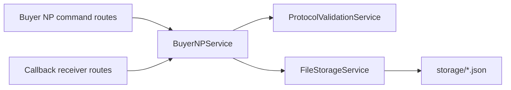

# Project Structure

Audit date: 2026-06-03

## Tree

```text
ONDC-POC/
├── app/
│   ├── api/
│   │   └── router.py
│   ├── callbacks/
│   │   └── ondc_callbacks.py
│   ├── core/
│   │   ├── config.py
│   │   ├── errors.py
│   │   └── logging.py
│   ├── models/
│   │   └── transaction_store.py
│   ├── repositories/
│   │   ├── __init__.py
│   │   └── transaction_repository.py
│   ├── routes/
│   │   └── ondc.py
│   ├── schemas/
│   │   ├── examples.py
│   │   ├── fis14.py
│   │   ├── ondc.py
│   │   └── transaction.py
│   ├── services/
│   │   ├── buyer_np_service.py
│   │   ├── file_storage_service.py
│   │   ├── mock_payloads.py
│   │   ├── ondc_service.py
│   │   ├── protocol_validation.py
│   │   ├── registry_service.py
│   │   ├── signing_service.py
│   │   └── verification_service.py
│   └── main.py
├── fis-specs/
├── postman/
├── scripts/
├── storage/
│   ├── search/
│   ├── select/
│   ├── init/
│   ├── confirm/
│   └── callbacks/
├── .env.example
├── requirements.txt
└── README.md
```

## Folder Purpose

| Folder | Purpose |
|---|---|
| `app/routes/` | Buyer NP command APIs |
| `app/callbacks/` | Buyer NP callback receiver APIs |
| `app/services/` | Buyer NP orchestration, filesystem persistence, registry/signing boundaries |
| `app/repositories/` | Repository protocol and default repository export |
| `app/schemas/` | FIS14 context, ACK, event, and example schemas |
| `app/core/` | Settings, logging, shared errors |
| `storage/` | JSON persistence for commands and callbacks |
| `postman/` | Buyer NP UAT collection, environment, and payloads |
| `scripts/` | Postman generation and validation |

## Active Runtime Path



## Notes

- The active persistence implementation is `FileStorageService`.
- The repository protocol remains in `app/repositories/transaction_repository.py`.
- No fake signing is implemented.
- Signing and verification services are retained as production boundaries.
